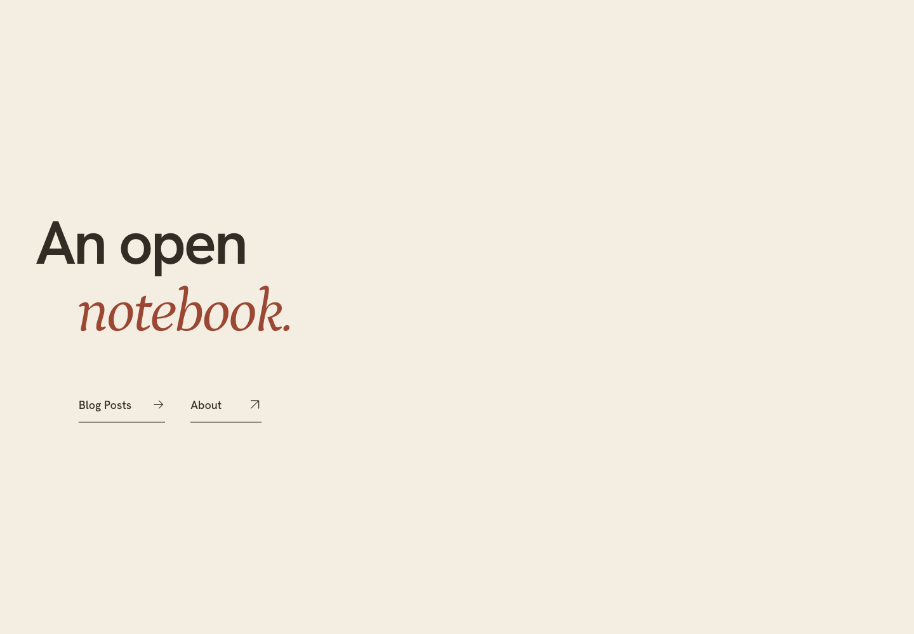
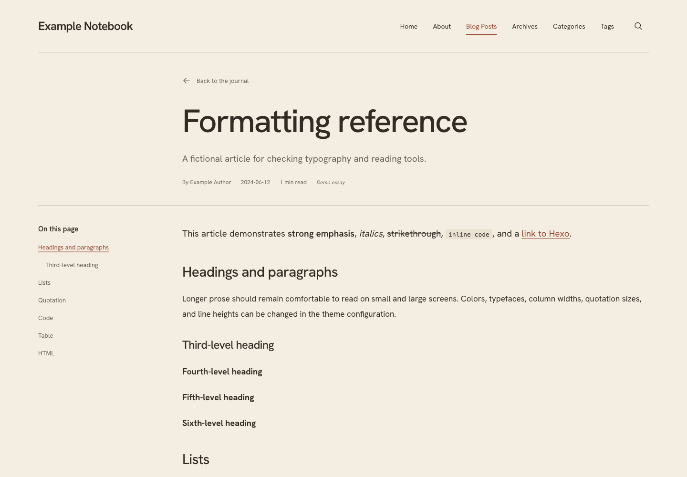

# Cosmos

[English](README.md) · [简体中文](README.zh-CN.md)

A warm editorial Hexo theme for writing, projects, and an expressive About page. Paper colors, local fonts, and generous spacing give your content room to breathe.

[Configuration](docs/configuration.md) · [Writing](docs/content.md) · [Help](docs/usage.md#faq) · [GitHub](https://github.com/cweiai/hexo-theme-cosmos)



## Features

- Full-screen cover or article-list homepage, with archives, categories, tags, and custom pages.
- About profile with editable labels and contact links, plus custom HTML support.
- Local search, article contents, reading progress, and code copying.
- Configurable colors, fonts, widths, navigation, footer, and mobile typography.
- Locally bundled fonts; no account, analytics service, or external CDN required.

## Install

Requires **Hexo 7–8**, **Node.js 20+**, npm, and Git. Node.js 24 is recommended.

In your **Hexo blog root**:

```sh
git clone https://github.com/cweiai/hexo-theme-cosmos.git themes/cosmos
cd themes/cosmos
npm install
cd ../..
```

Select Cosmos in the blog's `_config.yml`:

```yaml
theme: cosmos
index_generator:
  path: blog
  per_page: 10
  order_by: -date
```

Create `_config.cosmos.yml` in the blog root for your personal theme settings, then preview:

```sh
npx hexo clean
npx hexo generate
npx hexo server
```

Open the address printed by Hexo, normally `http://localhost:4000/`. New to Hexo or using a theme archive? The [installation instructions](docs/usage.md#install) cover both.

## Documentation

| Topic | Direct link |
| --- | --- |
| Theme settings, examples, and defaults | [Configuration](docs/configuration.md) |
| About labels, profile, and contacts | [About configuration](docs/configuration.md#about) |
| Colors, fonts, and reading widths | [Style settings](docs/configuration.md#style-details) |
| Writing and portfolio presets | [Ready-to-use configurations](docs/configuration.md#ready-to-use-configurations) |
| Posts, About HTML, and custom pages | [Writing](docs/content.md) |
| RSS, comments, formulas, and diagrams | [Optional integrations](docs/content.md#optional-integrations) |
| Theme updates and recovery | [Update and rollback](docs/usage.md#update-and-rollback) |
| Configuration, routing, and asset problems | [Troubleshooting](docs/usage.md#faq) |



## Feedback

[Report a bug](https://github.com/cweiai/hexo-theme-cosmos/issues/new?template=bug.yml) · [Request a feature](https://github.com/cweiai/hexo-theme-cosmos/issues/new?template=feature.yml)

Include theme, Hexo, and Node versions, the first error, and minimal reproduction steps when reporting a problem.

## License

Original Cosmos code is [MIT licensed](docs/license.md). Bundled fonts and icons retain the licenses listed in [third-party notices](THIRD_PARTY_NOTICES.md).
